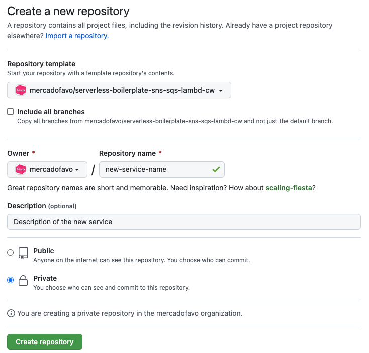

<h1 align="center">
  Serverless Boilerplate SNS SQS LAMBDA CLOUDWATCH
</h1>
<p align="center">XXXXX.</p>

## 🔥 How to use the template

1. Create a new repo using this template, like so:
   
2. Clone your new project, e.g.:

```
git clone git@github.com:mercadofavo/new-service-name.git
```

3. Replace the standard names on the template (`ctrl + shift + f` in VSCode):
   1. `ServerlessBoilerplate` to your `<NewServiceName>`;
   2. `serverlessBoilerplate` to your `<newServiceName>`;
   3. `myFunction` to your `<newFunctionName>`.
4. Replace folder `myFunction` to your `<newFunctionName>`.

## 🙏 Contribute

First, make sure you have installed [Node.js](https://nodejs.org/en/download/) (Node 16.17.0 or later) and the classic [Yarn](https://classic.yarnpkg.com/lang/en/) dependency.

Clone the project:

```sh
git clone git@github.com:mercadofavo/serverless-boilerplate-sns-sqs-lambda-cws.git
```

Install the dependencies:

```bash
yarn bootstrap
```

## 🚀 Workflow via Github Actions

When you open a PR:

- `quality.yml` runs linter, tests and typecheck;

When you merge a PR:

- `staging.yml` deploys the serv-boilerplate-sns-sqs-lambd-cw stack to staging;
- `production.yml` deploys the serv-boilerplate-sns-sqs-lambd-cw stack to production;

## ✍ ADRs - Architecture Decision Records

XXXXX.

## 📄 Context

2022-02-24

XXXXXX.

This is the architecture design for this project. Please mantain this diagram updated

## Architecture

This is the model of the Cloudformation stack created by this project. All of these pieces are defined in the resource files. After any modification to these files, please deploy the project again. It may be necessary to manually delete the current staging/production stacks.

## 🧪 Automated Testing

After every commit, git hooks are executed with [Husky](https://typicode.github.io/husky/) and the automated test suite is run with [Jest](https://jestjs.io/docs/getting-started).

Prefer following Test Driven Development when creating new features to keep our code quality high. Remember that TDD is not about testing, is about design.

## 🎯 Project features

### Project structure

### 3rd party libraries

- [json-schema-to-ts](https://github.com/ThomasAribart/json-schema-to-ts) - uses JSON-Schema definitions used by API Gateway for HTTP request validation to statically generate TypeScript types in your lambda's handler code base
- [middy](https://github.com/middyjs/middy) - middleware engine for Node.js lambda. This template uses [http-json-body-parser](https://github.com/middyjs/middy/tree/master/packages/http-json-body-parser) to convert API Gateway `event.body` property, originally passed as a stringified JSON, to its corresponding parsed object
- [@serverless/typescript](https://github.com/serverless/typescript) - provides up-to-date TypeScript definitions for your `serverless.ts` service file
- [serverless-prune-plugin](https://github.com/claygregory/serverless-prune-plugin) - prunes old lambda versions.
- [serverless-plugin-aws-alerts](https://github.com/ACloudGuru/serverless-plugin-aws-alerts) - creates alerts automatically in CloudWatch.
- [serverless-plugin-canary-deployments](https://github.com/davidgf/serverless-plugin-canary-deployments) - implement canary deployments of Lambda functions with AWS CodeDeploy.
